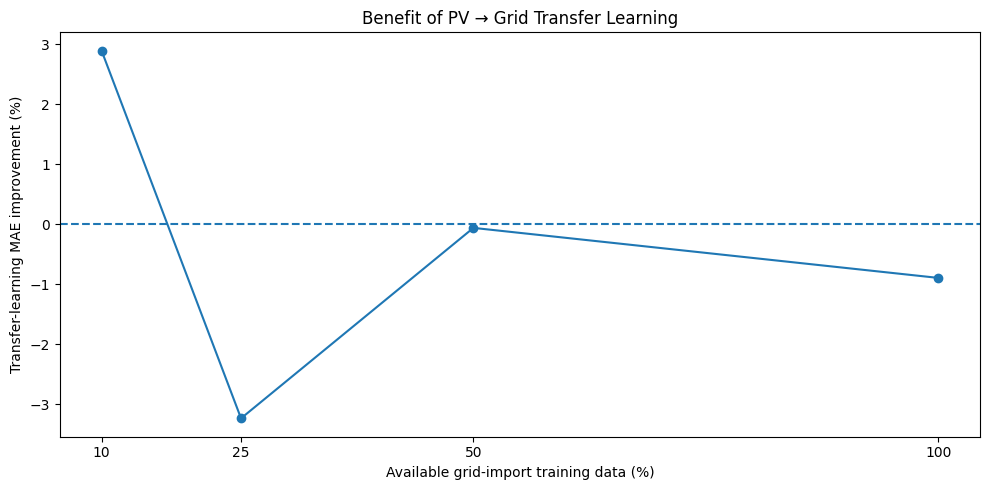
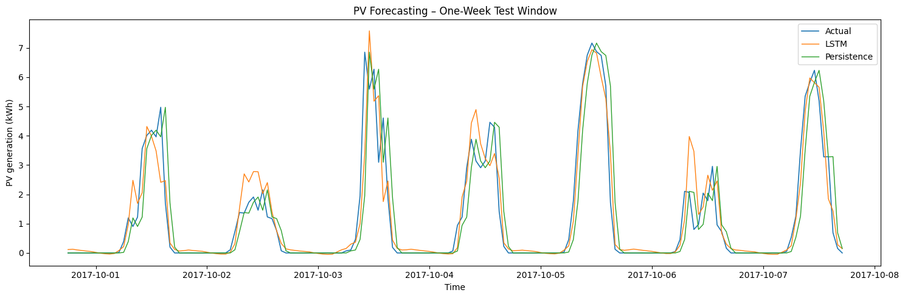
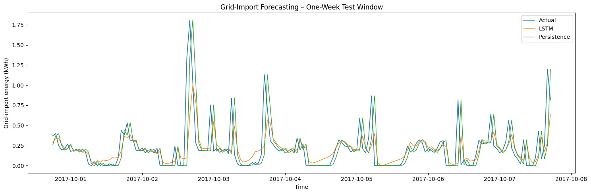
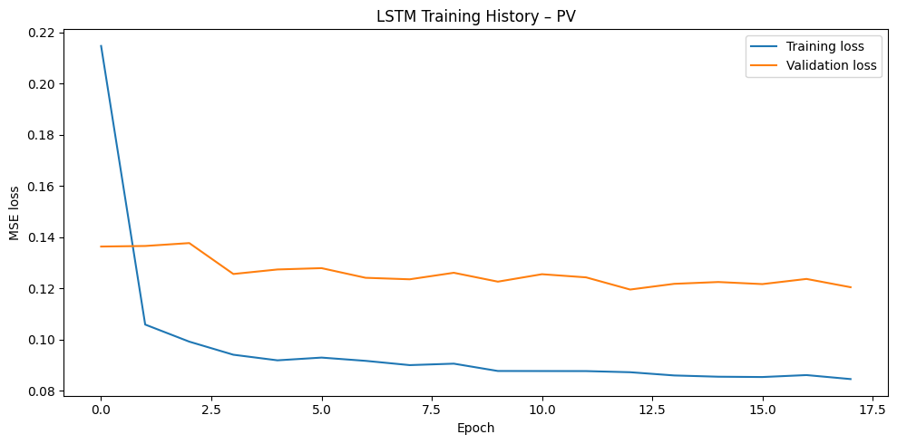
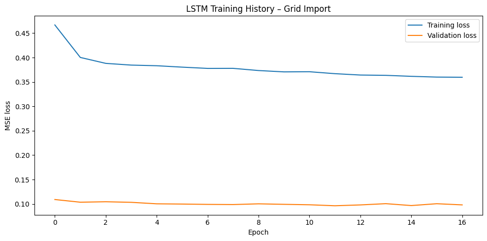

# Energy Time-Series Forecasting and Transfer Learning

## Overview

This project explores machine learning methods for short-term household energy forecasting using Python.

The project compares:
- Persistence forecasting
- LSTM-based forecasting
- Transformer-based forecasting
- Transfer learning between related energy forecasting tasks

The analysis focuses on photovoltaic (PV) generation and grid electricity import, with the objective of evaluating next-hour forecasting performance and whether transfer learning can help when target-domain data are limited.

## Objectives

1. Explore and preprocess household energy time-series data.
2. Establish a persistence forecasting baseline.
3. Develop an LSTM model for next-hour forecasting.
4. Develop a Transformer model for the same task.
5. Compare models using MAE and RMSE.
6. Investigate transfer learning between related energy forecasting tasks.
7. Evaluate transfer learning under target-domain data scarcity.

## Dataset

The project uses the **Open Power System Data (OPSD) Household Data**, focusing on Residential 4 in southern Germany.

The original data contain cumulative energy readings. These were converted to hourly energy values by differencing consecutive readings where timestamps were exactly one hour apart.

The largest continuous raw-valid block used was:

**2015-10-10 16:00 UTC to 2018-02-04 23:00 UTC**

This contains:
- 20,360 raw observations
- 20,359 usable hourly increments

No negative differences were observed for the PV or grid-import series used.

## Methodology

### Data preprocessing

The workflow includes:
- Loading the household energy dataset
- Selecting PV generation and grid-import variables
- Converting cumulative readings into hourly energy
- Identifying the largest continuous valid time block
- Chronological 70/15/15 train/validation/test splitting
- Fitting scalers using training data only
- Creating sliding windows

A **24-hour lookback window** is used to predict the next hourly value.

### Persistence baseline

The previous observed value is used as the next-hour forecast. This provides a simple benchmark against which the neural-network models are evaluated.

### LSTM forecasting

The LSTM uses the previous 24 hours to predict the next hour.

```text
Input: 24 hourly observations
        |
LSTM (64 units)
        |
Dropout (0.2)
        |
Dense (32, ReLU)
        |
Dense (1)
        |
Next-hour forecast
```

Configuration:
- Optimizer: Adam
- Loss: Mean Squared Error
- Batch size: 64
- Maximum epochs: 30
- Early stopping patience: 5
- Best weights restored

Implementation: TensorFlow/Keras.

### Transformer forecasting

A Transformer encoder is evaluated using the same forecasting setup.

```text
Input: 24 hourly observations
        |
Linear projection
        |
Sinusoidal positional encoding
        |
Transformer Encoder
        |
Dense (32)
        |
Output layer
        |
Next-hour forecast
```

Configuration:
- Input size: 1
- Model dimension: 64
- Attention heads: 4
- Transformer layers: 2
- Feed-forward dimension: 128
- Dropout: 0.1
- Activation: GELU

Implementation: PyTorch.

## Results

### LSTM vs Persistence

| Target | Model | MAE | RMSE |
|---|---|---:|---:|
| PV | Persistence | 0.3710 | 0.7224 |
| PV | LSTM | **0.2567** | **0.5005** |
| Grid import | Persistence | 0.3300 | 0.4846 |
| Grid import | LSTM | **0.2814** | **0.3978** |

### Improvement over persistence

| Target | MAE improvement | RMSE improvement |
|---|---:|---:|
| PV | 30.8% | 30.7% |
| Grid import | 14.8% | 17.9% |

The LSTM substantially improves on the persistence baseline, particularly for PV forecasting.

### LSTM vs Transformer

For PV forecasting:

| Model | PV MAE |
|---|---:|
| LSTM | **0.2567** |
| Transformer | 0.2817 |

For grid-import forecasting, the Transformer achieved a lower MAE than the LSTM:

| Model | Grid MAE |
|---|---:|
| LSTM | 0.2814 |
| Transformer | **0.2694** |

The LSTM retained a slight advantage in RMSE for grid import. Overall, the results do not indicate that the Transformer is universally superior; performance depends on the forecasting task.

## Transfer Learning

A transfer-learning experiment was performed to investigate whether knowledge learned from PV forecasting could be transferred to the related grid-import forecasting task.

A Transformer was first pretrained on the PV forecasting task. The learned input projection and Transformer encoder were then transferred to the grid-import task, while a new forecasting head was trained for the target task.

Two approaches were compared:

1. Transformer trained from scratch on grid-import data
2. Transformer initialised using knowledge transferred from the PV forecasting task

The experiment was repeated using different amounts of available grid-import training data:

- 10%
- 25%
- 50%
- 100%

This was designed to test whether transfer learning becomes more useful when the target task has limited training data.

### Transfer-learning benefit



The figure shows the percentage change in MAE obtained through transfer learning relative to training the target model from scratch.

Positive values indicate an improvement from transfer learning, while negative values indicate that the transferred model performed worse than the model trained from scratch.

The largest positive effect occurs when only **10% of the grid-import training data** are available, with approximately **2.9% MAE improvement**.

At 25% of the available target data, transfer learning instead results in approximately a **3.2% decrease in MAE performance**. At 50% the difference is close to zero, while at 100% transfer learning results in approximately a **0.9% decrease in MAE performance**.

These results suggest that transferring knowledge from PV forecasting can provide a small benefit under severe target-data scarcity, but the benefit is not consistent as more target-domain data become available.

## Figures

The main figures are embedded directly in this README.

### PV forecasting



### Grid-import forecasting



### PV training and validation loss



### Grid training and validation loss



The figure files should be placed in the **same flat repository location as `README.md`**. No `figures/` folder is required.

## Key Findings

### LSTM

The LSTM substantially outperformed persistence for both PV and grid-import forecasting, with the largest relative improvement observed for PV.

### Transformer

The Transformer produced competitive results but did not consistently outperform the LSTM. This demonstrates that model performance depends on the characteristics of the forecasting task.

### Transfer Learning

The largest positive effect occurs when only **10% of the grid-import training data** are available, with approximately **2.9% MAE improvement**.

At 25% of the available target data, transfer learning instead results in approximately a **3.2% decrease in MAE performance**. At 50% the difference is close to zero, while at 100% transfer learning results in approximately a **0.9% decrease in MAE performance**.

These results suggest that transferring knowledge from PV forecasting can provide a small benefit under severe target-data scarcity, but the benefit is not consistent as more target-domain data become available.

## Limitations

- Only one household dataset is considered.
- The forecasting models are univariate.
- A 24-hour historical window is used.
- The transfer-learning experiment uses a single experimental setup and seed.
- Transfer-learning improvements are modest and inconsistent across all data fractions.
- Weather, calendar, electricity-price and other exogenous variables are not included.
- Generalisation across multiple households and locations is not evaluated.

## Future Work

Potential extensions include:
- Multivariate forecasting using weather and calendar variables
- PV forecasting using irradiance and weather data
- Cross-household transfer learning
- Cross-location transfer learning
- Hyperparameter optimisation
- Multiple random seeds and statistical evaluation
- Probabilistic forecasting
- Longer forecasting horizons
- Additional forecasting architectures
- Integration with battery energy-storage optimisation
- Forecast-informed energy management and smart-grid applications

## Repository Structure

The repository intentionally uses a **flat structure**:

```text
energy-time-series-transfer-learning/
├── README.md
├── 01_data_exploration.ipynb
├── 02_lstm_forecasting.ipynb
├── 03_transformer_forecasting.ipynb
├── 04_transfer_learning.ipynb
├── household_data_60min_singleindex_filtered.csv
├── pv_forecasting.png
├── grid_forecasting.png
├── pv_training_loss.png
└── grid_training_loss.png
```

The notebooks follow the workflow:
1. `01_data_exploration.ipynb` — dataset exploration and preprocessing
2. `02_lstm_forecasting.ipynb` — LSTM forecasting and persistence comparison
3. `03_transformer_forecasting.ipynb` — Transformer forecasting
4. `04_transfer_learning.ipynb` — transfer learning under target-data scarcity

## Technologies

- Python
- Pandas
- NumPy
- Matplotlib
- Scikit-learn
- TensorFlow / Keras
- PyTorch
- Jupyter Notebook

## Skills Demonstrated

- Time-series preprocessing
- Chronological train/validation/test splitting
- Data leakage prevention
- Feature scaling
- Sliding-window sequence generation
- LSTM neural networks
- Transformer architectures
- PyTorch
- TensorFlow/Keras
- Model evaluation
- Baseline comparison
- Transfer learning
- Forecasting under data-scarcity conditions

## Author

**Mohamed Al-Mandhari**

Energy engineering / renewable energy / smart energy systems
